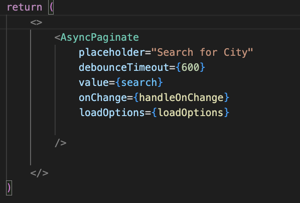
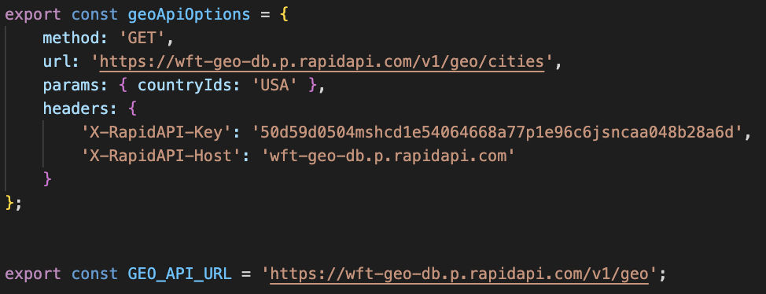
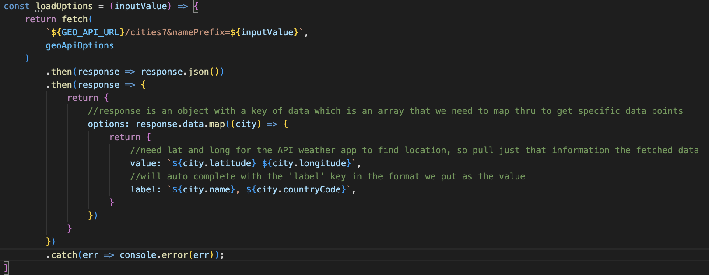
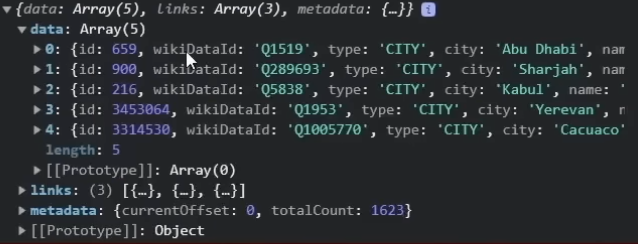
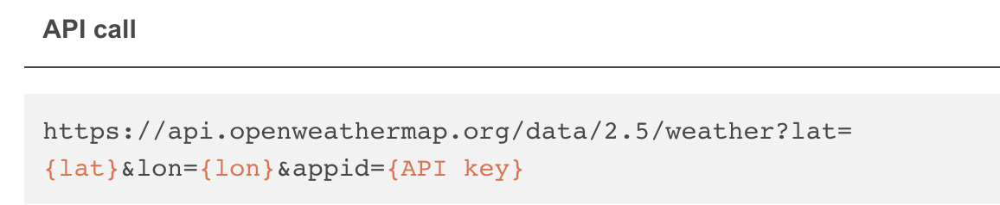

# Weather App

## Frontend technologies used:

 
 
 

## Summary

* For this project I used two API calls: 
  1) OpenWeatherAPI
  2) GeoDBCities
* To use the website, simply enter in a city of your choosing and the website will display that cities temperature and the forecast for the next week. 
* I downloaded two packages: 
  1) npm react-accessible-accordion
  2) npm react-select-async-paginate

## GeoDB Cities
* GeoDB was primarily used to get the location of where I wanted to get the weather of. 

## OpenWeatherAPI
* Open Weather API was primarily used to get and forecast the weather of a specific location

## Accordion
* Accordion component allows the user to show and hide sections of related content on a page

## Async-Paginate
* AsyncPaginate is an alternative of Async but supports loading page by page. It is wrapper above default react-select thus it accepts all props of default Select. And there are some additional props that I used for the project.

# Walkthrough

## Search
1. The first thing I set up in this project was the search feature. To do this, I used the GeoDB cities API call to find the locations of cities. 

2. Next I create the search function using the Async Paginate package installed. 

  * It uses loadOptions function attribute to load the option into the select box and it expect return value as {options: [], hasMore: false}. 
  * Another additional feature of AsyncPaginate is the debounceTimeout - where it will wait after a given input (in milliseconds) for the last received action before executing suggestions to finish what you've typed. 
  * Value is the value inputed into the search bar
  * OnChange takes in a function that handles any changes in the search bar

3. Once adding this onto a separate file, I exported these variables to fetch that data in my search function. * Note * (you could also add specific parameters for the search such as: Min Population, Max population, etc. More can be found in the GeoDB documentation)

4. Next is the most important function that will fetch the data we need from the API. The loadOptions function (which is passed into the loadOptions argument) will return the data fetched from the API URL that we exported in the step above. 

  * Once we have the data we neeed to parse the response into json
  * Then return a value that the loadOptions argument can use. In this case, it is an object with a k/v pair with key as 'options' and value as whatever data we need. 
  * Specifically for the OpenWeatherAPI we need to latitude and longitude, so that is the data we are going to take.
  

  * The response is going to look something like the above image. We key into the the response.data then map through the array of data returning the lat and lon as the values and city and country code to make things a little easier when rendering the information. 

5. The last thing we need to do for the search feature is handle changes in the search bar in the handleOnChange function.
  * The first thing in the function set React State to thee value inputted in search bar. 
  * onSearchChange function comes from thee parent. This will be explained more in-depth, but it is essentially a asysn function that waits for GeoDB to find the location (using lat and lon) then uses OpenWeatherAPI to find the weather for that location. 

## Weather 

* Above is the API URL to fetch data. You need to get the latitude and longitude along with the given API when signing up. 

1. 
